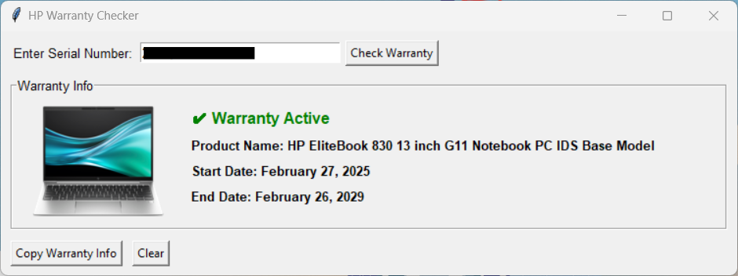
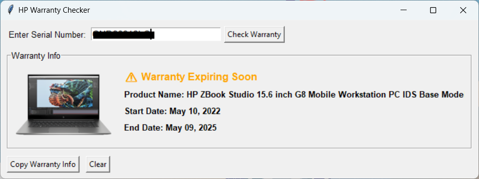

# HP Warranty Checker


---

## 📋 Description

**HP Warranty Checker** is a lightweight, standalone Python desktop application that allows you to check HP product warranty information based on a serial number. It displays the product name, warranty start and end dates, warranty status (Active, Expiring Soon, Expired), and product image — all inside a clean, responsive Tkinter interface.

---

## 🚀 Features

- ✅ **Instant Warranty Status**: Active, Expired, or Expiring Soon
- 📅 **Start and End Dates** Display
- 🖼️ **Product Image** Preview
- 📋 **One-Click Copy** Warranty Information
- 🧩 **Fully Self-Contained** Executable – no installation needed
- 🔐 **No Local Installation** Required – just run the `.exe` directly


---

## 🖼 Screenshots

**In Warranty Example:**  


**Warranty Expired Example:**  


**Warranty Expiring Soon Example:**  



---

## 📦 Executable Release

The latest `.exe` file is available in the Releases section.  
- It **includes Chromedriver** and **all required libraries** bundled together.
- **No installation** required – simply download and run.
- **Internet connection** is required at runtime (to fetch data from HP's website).

> You can optionally **package it yourself** if you want customizations — instructions are below.

---

## 🔧 Requirements (If You Want to Package Yourself)

If you wish to build the `.exe` manually:

- Python 3.8+
- Google Chrome installed
- Matching version of ChromeDriver

Install the required Python libraries:

```bash
pip install selenium pillow requests
```

---

## ⚙️ How to Package Yourself

You can package your own `.exe` version using [auto-py-to-exe](https://github.com/brentvollebregt/auto-py-to-exe):

1. Install:

```bash
pip install auto-py-to-exe
```

2. Run the GUI:

```bash
auto-py-to-exe
```

3. Recommended options:
    - ✅ Onefile
    - ✅ Window-based application (no console)
    - ✅ Include chromedriver in the same directory or bundle into `.exe`

---

## 📚 How It Works

- Uses **Selenium** in **headless Chrome** mode to scrape HP's warranty check page.
- Displays product details dynamically inside a **Tkinter** GUI.
- Product images are fetched using `requests`, resized, and displayed alongside details.

---

## ❗ Important Notes

- This tool **directly relies on HP's website structure**; any major site changes might temporarily break functionality.
- SSL certificate verification for product images is **disabled** for compatibility. (Not a security concern in this specific controlled case.)

---

## 🛡️ License

Free for personal, business and educational use.

---

## 🙏 Credits

- Built with [Python](https://www.python.org/)
- GUI powered by [Tkinter](https://wiki.python.org/moin/TkInter)
- Web scraping via [Selenium](https://selenium.dev/)
- Image processing with [Pillow](https://python-pillow.org/)
